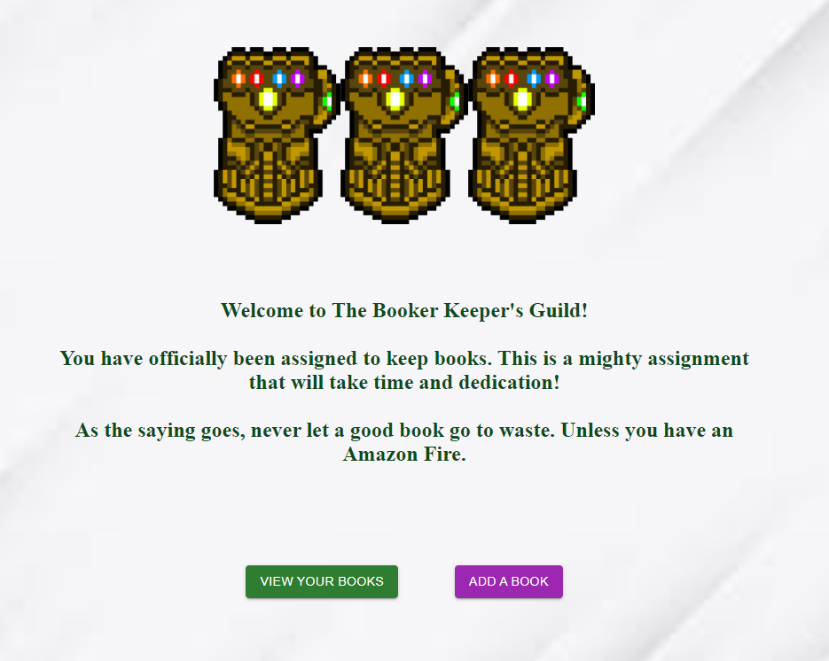

# The Bookkeeper's Guild

**Version 1.0**

A web application to store books you are interested in.

## Note

You are important.

## Installation Instructions

No installation necessary.

1. Click on live page.
2. Add, update, or delete books.

## Acceptance Criteria

Students have completed this project when:

- WHEN I click View Your Books Button
  THEN I am presented with a series of books I have entered into my collection
- WHEN I click Add A Book
  THEN I am presented with a page that holds field to enter my book details
- WHEN I click Update Button on my book
  THEN I have the option to edit book information
- WHEN aI click Delete Button on my book
  THEN the book will be deleted from the Book Keeper's Collection

## Screenshot

## Links

- [Deployed Website Link](https://bookkeeper11.herokuapp.com/)
- [Code Repository Link](https://github.com/AndrewT11/bookkeeper)

## Credits

- Andrew Tran
- Nikhil Thadani

### Resources

- https://www.w3schools.com/
- https://developer.mozilla.org/en-US/
- https://choosealicense.com/
- https://www.youtube.com/watch?v=2AIL1c-cJM0&t=1043s

### License

Copyright (c) [2022] [Andrew Tran]

Permission is hereby granted, free of charge, to any person obtaining a copy
of this software and associated documentation files (the "Software"), to deal
in the Software without restriction, including without limitation the rights
to use, copy, modify, merge, publish, distribute, sublicense, and/or sell
copies of the Software, and to permit persons to whom the Software is
furnished to do so, subject to the following conditions:

The above copyright notice and this permission notice shall be included in all
copies or substantial portions of the Software.

THE SOFTWARE IS PROVIDED "AS IS", WITHOUT WARRANTY OF ANY KIND, EXPRESS OR
IMPLIED, INCLUDING BUT NOT LIMITED TO THE WARRANTIES OF MERCHANTABILITY,
FITNESS FOR A PARTICULAR PURPOSE AND NONINFRINGEMENT. IN NO EVENT SHALL THE
AUTHORS OR COPYRIGHT HOLDERS BE LIABLE FOR ANY CLAIM, DAMAGES OR OTHER
LIABILITY, WHETHER IN AN ACTION OF CONTRACT, TORT OR OTHERWISE, ARISING FROM,
OUT OF OR IN CONNECTION WITH THE SOFTWARE OR THE USE OR OTHER DEALINGS IN THE
SOFTWARE.
